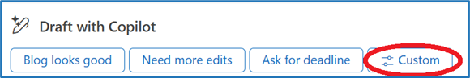

---
demo:
  title: 演示：Outlook 中的 Copilot
---

[返回到索引](https://microsoftlearning.github.io/MS-4012-Microsoft-Copilot-Web-Based-Interactive-Experience-for-Executives/)

# Outlook 中的 Microsoft 365 Copilot

## 演示设置

可在[此处](https://microsoft.seismic.com/Link/Content/DCFPQWmT2DMXC8WJjgjP4H44GWXG)找到有关此选项的演示设置的说明。 具体而言，第 1-4 页介绍如何设置将在下面的演示中引用的电子邮件线程。

> **重要提示：** 演示设置至少需要 4 人（可选为 6 人）。 在计划交付之前，请与团队进行此操作。 完成后，可以参考此电子邮件进行将来的交付。

## 讲座要点

“让我们看一个电子邮件线程。 这是一个虚构的讨论，团队正在讨论一篇关于 Copilot 的重要博客文章。 看起来可能很像每天看到的电子邮件线程。

当我通过 Copilot 按钮选择“摘要”时，Copilot 总结了我的线程，并给出最相关的要点。

这非常有用。 我一直有很长的电子邮件线程到达我的收件箱，要理清什么是重要的，什么是无关紧要的，这是一件苦差事。

我要回复，我会用 Copilot 帮我。 可以看到，Copilot 已经生成了一些建议的提示，因为 Copilot 已阅读电子邮件线程，并了解上下文以及我希望如何回复。

这很有用，但此回复需要自定义提示。 还可以编辑此提示以自定义回复的语气和长度。

当选择“听起来像我”时，Copilot 将查看传出的电子邮件，并确保其响应与我的个人沟通风格匹配。 让我们使用它。

这是相当不错的，但我认为它可以更好。 Copilot 的结果部分基于所问问题的质量。

好吧，我会保持这种响应。”

## 演示步骤

1. 切换到 Outlook，打开演示电子邮件线程。

    > **重要提示：** 不显示包含机密数据的任何电子邮件。

1. 在电子邮件的主题下方，选择“**Copilot 的摘要**”并指出结果。
1. 在页面顶部选择“**全部答复**”。
1. 在新电子邮件字段的底部，指出“**使用 Copilot撰写草稿**”部分和建议的提示。
1. 选择“自定义”。****

    


1. 在“**希望电子邮件显示的内容**”字段中，复制并粘贴提示或键入： 

    ```text
    Approve and thank the team--be warm! They worked hard. And be a little funny if you can.
    ```

1. 选择“**编辑提示**”按钮。

    

1. 选择“**听起来像我**”。
1. 然后选择“生成”  。
1. 选择“**有要更改的内容吗?**” 文本框。
1. 复制并粘贴提示或键入： 

    ```text
    Can you make a that a bit longer? It's just a little bit too short.
    ```

1. 选择“**生成**”按钮。  
1. **可选**：在“**有要更改的内容吗?**” 文本框，键入“**使其更有趣**”，然后选择“生成”。
1. 选择“**保留它**”。

    > **注意：** 不要发送回复，因为你可能希望重新使用此电子邮件线程进行将来的演示。

[返回到索引](https://microsoftlearning.github.io/MS-4012-Microsoft-Copilot-Web-Based-Interactive-Experience-for-Executives/)
