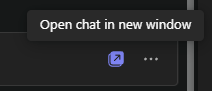

---
demo:
  title: 演示：Teams 中的 Copilot
---

[返回到索引](https://microsoftlearning.github.io/MS-4012-Microsoft-Copilot-Web-Based-Interactive-Experience-for-Executives/)

# Teams 中的 Copilot

## 演示设置

若要确保演示顺利，请选择以下设置选项之一：

**选项 A：会议回顾**

可在[此处](https://microsoft.seismic.com/Link/Content/DCFPQWmT2DMXC8WJjgjP4H44GWXG)找到有关此选项的演示设置的说明。 具体而言，请参阅第 5-10 页，其中介绍了如何设置 Teams 会议（项目 Avalon），我们将在下面的演示中引用。

> **重要提示：**
> - 选项 A 演示设置需要至少 4 人（可选为 6 人）。
> - 在计划交付之前，请与团队进行此操作。
> - 完成后，可以参考此 Teams 会议，了解将来的交付情况。
> - 如果出于任何原因无法执行准备工作，请参考选项 B 演示。

**选项 B：Teams 聊天**

此演示选项特意不需要预先设置。 但是，你需要利用自己的一个预先存在的 Teams 聊天线程。 在将此聊天用于演示之前，请确保在此聊天中没有共享的机密信息。


## 选项 A - 会议回顾演示

### 讲座要点

“现在，我要展示我们在 Teams 中所谓的会议回顾。

下面是我和同事之间的会议。 由于保密原因，无法展示我们的真实会议，但这是我和团队录制的一个虚构会议，讨论启动一个名为“Avalon 项目”的虚构产品。

回顾基于录制听录。 它显示了谁参与讨论以及讨论的时间。 还有关于我们讨论内容的摘要。 Copilot 已按部分组织了会议，我可以更轻松地找到所寻找的内容。

现在，我可以提出 Copilot 的问题，并获取有关这次会议的详细信息。 例如，让我们看看所讨论的内容以及每个人的操作项是什么。”

### 演示步骤

1. 切换到打开了 Microsoft Teams  的浏览器选项卡，进入会议 **项目 Avalon 启动会议**。

    > **重要提示：** 不显示包含机密数据的任何会议或聊天。

1. 选择“**回顾**”选项卡。

    

1. 指出“**演讲者**”。
1. 选择**主题**。

    

1. 选择“**章节**”。

    

1. 选择右上角的“**Copilot**”。

    

1. 在“**询问关于此会议的任何内容**”的文本框的中，复制并粘贴提示：

    ```text
    Can you list action items and owners in a table?
    ```

1. 选择“发送”。
1. 在“**询问关于此会议的任何内容**”的文本框的中，复制并粘贴提示： 

    ```text
    Did anyone strongly oppose the decision, and how do you know?
    ```
    
1. 选择“发送”。
1. 在“**询问关于此会议的任何内容**”的文本框的中，复制并粘贴提示：

    ```text
    Based on the transcript, when would you recommend we launch the product and why?
    ```

1. 选择“发送”。

## 选项 B - Teams 聊天

### 讲座要点

“现在，我要向你展示 Copilot 如何增强 Teams 聊天体验。

下面是我和同事之间的聊天线程。 Copilot 帮助汇总聊天中的重要事件，因而无需阅读每条消息，即可更轻松地捕捉要点。

现在，我可以向 Copilot 提问，从聊天中获取更具体的信息。 例如，我们来了解有哪些未完成项，以及我们应该如何继续执行后续步骤。

此外，我可以起草回复，并使用 Copilot 来优化回复，确保我的消息简洁明了。 这对于确保团队内的有效沟通特别有用。

### 演示步骤

1. 查找未共享任何机密信息的 Teams 聊天线程。 选择“**在新窗口中打开聊天**”选项。

    

1. 在新窗口中打开 Teams 聊天后，选择右上角的“**打开 Copilot**”。

    

1. 在打开的 Copilot 聊天窗格中，选择“**过去一天的重要事件**”，快速汇总过去一天的聊天内容。

    

1. 在“**提出有关此聊天的问题**”文本框中，复制并粘贴提示： 

    ```text
    What are the open items?
    ```
    > **注意：** 可以随意选择一个你认为更符合受众需求的替代提示示例。   

1. 在聊天历史记录下，在“**键入消息**”文本框中，开始键入回复。 **先不要点击发送。**

1. 在回复草稿中，从“**键入消息**”文本框中选择 Copilot。

       

1. 试用“**重写**”和“**调整**”助手选项，以进一步演示 Copilot 功能。

         

[返回到索引](https://microsoftlearning.github.io/MS-4012-Microsoft-Copilot-Web-Based-Interactive-Experience-for-Executives/)
